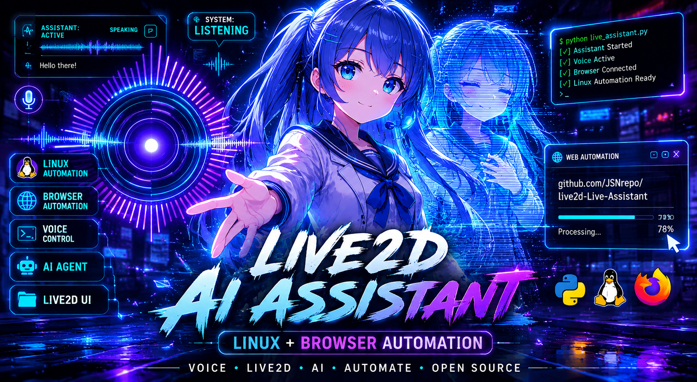

# LivePythonGemini — Sakura AI Companion

An AI voice companion powered by **Google Gemini Live** with a Live2D animated
character overlay, real-time audio processing, and an agentic tool layer for
browser automation, file operations, system control, and web search.

---

## Showcase

Here is a visual demonstration of the Sakura AI Companion floating overlay, high-fidelity audio visualizers, and reactive interface:

### UI Interface Overview


### Mode Toggling & Arc Reactor Ticks (Circle/Linear Styles)
<video src="demos/Screencast_20260601_111248.mp4" controls width="100%" poster="demos/thumbnail001.png" style="max-height: 480px; border-radius: 8px; margin-top: 8px;"></video>

---

## Architecture

```
┌─────────────────────────────────┐
│           main.py               │
│  ┌──────────────────────────┐   │
│  │  Gemini Live WebSocket   │   │  ← google.genai realtime session
│  │  (asyncio TaskGroup)     │   │
│  │  ├── mic_reader()        │   │  ← PyAudio capture @ 16kHz
│  │  ├── send_audio()        │   │  ← streams PCM to Gemini
│  │  ├── recv_audio()        │   │  ← receives audio + tool calls
│  │  ├── play_audio()        │   │  ← pitch shift → PyAudio playback @ 24kHz
│  │  ├── monitor_system_*()  │   │  ← CPU/RAM/disk alerts
│  │  └── tail_terminal_*()   │   │  ← error log monitoring
│  └──────────────────────────┘   │
│  ┌──────────────────────────┐   │
│  │  Tool Layer              │   │
│  │  ├── search_web_contents │   │  ← DuckDuckGo Lite + Wikipedia API
│  │  ├── run_terminal_cmd    │   │  ← cross-distro shell (with confirmation)
│  │  ├── open_application    │   │  ← DE-aware app launcher (GNOME/KDE/XFCE…)
│  │  ├── webbridge_*         │   │  ← Kimi browser automation
│  │  ├── run_browser_task    │   │  ← agentic Gemini sub-loop (async)
│  │  ├── memory_graph_*      │   │  ← JSON memory store
│  │  └── control_media / music   │
│  └──────────────────────────┘   │
│  ┌──────────────────────────┐   │
│  │  Curses TUI (main thread)│   │  ← renders state/emotion/RMS
│  └──────────────────────────┘   │
└────────────────┬────────────────┘
                 │ UDP port 10088
                 ▼
┌─────────────────────────────────┐
│        live2d_gui.py            │  ← subprocess
│  pywebview (Qt/GTK/auto)        │
│  index.html + PIXI.js + Cubism4 │  ← Live2D character overlay
└─────────────────────────────────┘
```

## Key Components

| File | Purpose |
|---|---|
| `main.py` | Core async loop, audio pipeline, tool routing, Gemini session |
| `live2d_gui.py` | Standalone subprocess: pywebview window with Live2D |
| `index.html` | Live2D PIXI canvas, speech bubble UI, UDP command receiver |
| `config.toml` | Runtime configuration (voice, models, audio, emotions, noise gate) |
| `persona.txt` / `hyori.txt` | System instruction / personality prompt |
| `emoticons.json` | Emotion → animation frame mapping for the Live2D model |
| `run.sh` | Cross-distro launcher — auto-detects terminal emulator |
| `run_live2d.sh` | Launches `live2d_gui.py` + `main.py --live2d` together |

## Prerequisites

```bash
# Python 3.11+
python -m venv .venv
source .venv/bin/activate
pip install -r requirements.txt
```

Required system packages:
- `portaudio19-dev` (PyAudio backend)
- `python3-pyqt5` or `python3-gi` (pywebview GUI backend)
- `playerctl` (optional — media control)
- `psutil` (process monitoring)

## Configuration

Copy `.env.example` → `.env` and set your API keys:

```
GOOGLE_API_KEY=your_key_here
KIMI_WEBBRIDGE_API_KEY=your_key_here
```

Edit `config.toml` to change voice, model names, pitch factor, noise gate, etc.

## Running

```bash
# Full mode with Live2D overlay
./run_live2d.sh

# Terminal-only (no GUI)
./run.sh

# Or directly
.venv/bin/python main.py
.venv/bin/python main.py --live2d
```

## Audio Pipeline

Gemini Realtime API delivers PCM audio at 24 kHz / 16-bit mono.
`play_audio()` applies a vectorised pitch shift (scipy FFT resample)
to raise the voice pitch by the configured `pitch_factor`, then streams
the result to PyAudio in 20ms sub-chunks for low-latency lip-sync.

## Tool Capabilities

- **Web search** — DuckDuckGo Lite + Wikipedia API fallback
- **Browser automation** — Kimi WebBridge (open tabs, click, fill, scroll)
- **Terminal** — run commands with confirmation for destructive ops
- **Applications** — launch any app, DE-aware for GNOME/KDE/XFCE/MATE/LXQt
- **Media** — playerctl integration (play/pause/next/volume)
- **Memory** — persistent JSON knowledge graph
- **Screen** — periodic screenshot analysis via Gemini Vision
- **System** — CPU/RAM/disk monitoring with threshold alerts
